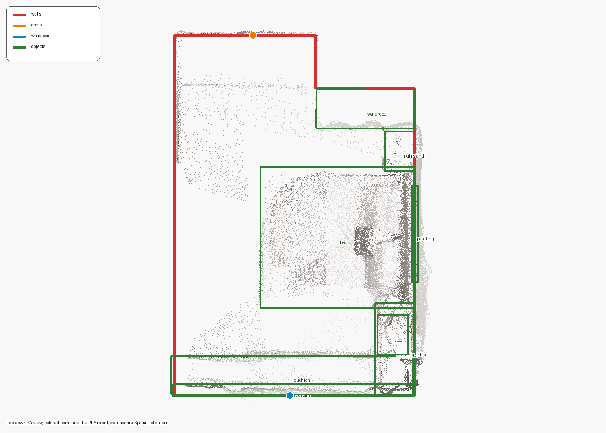

# SpatialLM Official Sample Demo

这个 demo 不依赖尚未实现的上游点云模块。它读取 SpatialLM 官方示例 PLY，
执行真实模型推理，并展示空间信息进入 OmniRoboAgent 后的三个阶段：

```text
scene0000_00.ply
  -> SpatialLMBackend.infer_points()
  -> observation["spatial_context"]
  -> TieredMemory.update()
  -> TieredMemory.recall()
```

它不会调用 LLM Planner 或 Verifier，也不会执行机器人动作。保存的两个
`planner_input_*.json` 用来展示 Planner 在 Memory 更新前后会接收到什么。

## 已验证结果

2026-09-19 使用包内模型、`seed=42` 和 RTX 4090 D 完成并保存真实运行：

- 模型加载：约 `2.89 s`
- SpatialLM 推理：约 `3.37 s`
- 总流程：约 `6.42 s`
- 输出：`6 walls / 1 door / 1 window / 8 objects`

[查看完整结果摘要](output/scene0000_00_seed42/summary.md)。



## 输入

`input/scene0000_00.ply` 来自
[manycore-research/SpatialLM-Testset](https://huggingface.co/datasets/manycore-research/SpatialLM-Testset)：

- 文件：`pcd/scene0000_00.ply`
- License：`CC-BY-NC-4.0`
- 大小：`10,968,451` bytes
- 点数：`685,513`
- SHA-256：
  `12d8cf9c239791260166837d090334915f7056537a2e35c97959d9842a6c5f92`

## 运行

先按交付目录根 README 安装 SpatialLM 和 OmniRoboAgent。然后从交付目录根执行：

```bash
python examples/spatiallm_demo/run_demo.py
```

常用参数：

```bash
python examples/spatiallm_demo/run_demo.py \
  --input examples/spatiallm_demo/input/scene0000_00.ply \
  --model-path models/SpatialLM1.1-Qwen-0.5B \
  --output-dir examples/spatiallm_demo/output/my-run \
  --detect-type all \
  --seed 42
```

## 输出

默认输出目录为 `output/scene0000_00_seed42/`：

| 文件 | 内容 |
| --- | --- |
| `summary.md` | 本次结果入口和实体数量 |
| `top_down.png` | 输入点云与预测 geometry 的 XY 俯视叠加图 |
| `input_manifest.json` | 输入来源、哈希、点数和 XYZ 范围 |
| `spatial_context.json` | SpatialLM 的 geometry-only 输出 |
| `observation.json` | `spatial_context` 放入 observation 后的结构 |
| `planner_input_before_memory_update.json` | 当前 observation 已有空间信息，但 recall 尚为空 |
| `memory_recall.json` | `Memory.update()` 后带 provenance 的空间快照 |
| `planner_input_after_memory_update.json` | 下一轮规划可同时取得 observation 和 recalled memory |
| `memory_events.jsonl` | TieredMemory 持久化的 transition 摘要 |
| `run_metadata.json` | 模型参数、软件版本、GPU、耗时和实体数量 |
| `run.log` | 控制台运行日志 |

推理使用固定 `seed=42`，但 GPU 上的 sampled generation 不保证不同机器间
bitwise 完全一致。
